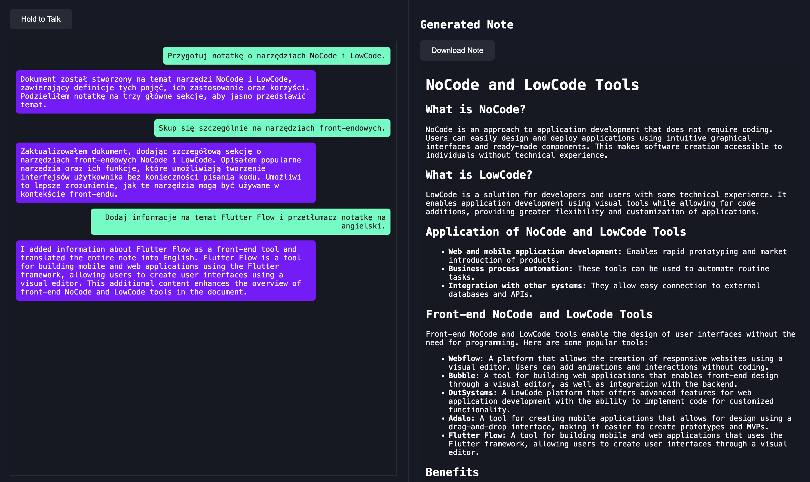

# VoiceNotes

VoiceNotes is a simple demonstration project that showcases the integration of speech-to-text functionality with a language model to create and update cohesive notes in Markdown format. This project highlights the use of GenAI and Python for developing AI-powered applications.

## Features

- **Speech-to-Text**: Transcribe audio input into text using advanced AI tools.
- **LLM-Powered Notes**: Automatically structure and enhance notes based on the transcribed text.
- **Markdown Output**: Notes are generated and updated in Markdown format for easy readability and sharing.

## Requirements

To set up and run this project, ensure you have the following installed:

- Python 3.9 or higher
- Dependencies listed in `requirements.txt`

Install the dependencies with:
```bash
pip install -r requirements.txt
```

Additionally, you need your own API keys for:
- [Replicate](https://replicate.com/)
- [OpenAI](https://openai.com/)

These keys should be added to your environment variables.

## Setup

This project is configured with a `devcontainer.json` file for easy development in a containerized environment. To use it:

1. Ensure you have Docker installed and running.
2. Open the project in a development environment that supports DevContainers (e.g., VS Code).
3. The environment will be automatically configured with all necessary dependencies.

Alternatively, you can run the project locally by setting up a Python virtual environment:

```bash
python -m venv venv
source venv/bin/activate  # On Windows, use `venv\Scripts\activate`
pip install -r requirements.txt
```

## Usage

1. Start the application by running the following command:
   ```bash
   uvicorn main:app --reload
   ```
2. Open your browser and navigate to `http://127.0.0.1:8000` to access the web interface.
3. Interact with the interface by holding the "Hold to Talk" button to input speech. Your notes will be generated and displayed on the right.

### Screenshot

Below is an example of the application in action:



## Endpoints

Refer to the `main.py` file for detailed information about the available API endpoints and their functionality.

## Limitations

- This project is intended for demonstration purposes only.
- There are no plans for active maintenance or hosting.

## License

You are free to use this project for non-commercial purposes.

## Acknowledgements

This project leverages the following technologies and libraries:

- [FastAPI](https://fastapi.tiangolo.com/)
- [Replicate](https://replicate.com/)
- [OpenAI API](https://openai.com/api/)

---

**Note**: This project is a simple proof of concept and is not intended for production use. Enjoy experimenting with it and exploring its capabilities!
